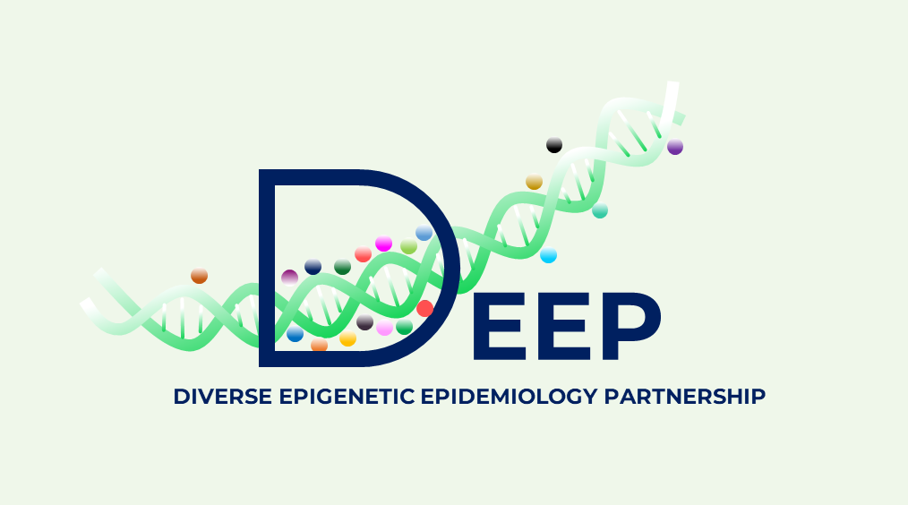

# What is DEEP?

The Diverse Epigenetic Epidemiology Partnership (DEEP) is a partnership of 20 research groups from around the world that aims to improve global health by exploring the effects of genomic diversity on disease risk across groups with many different ancestries. 

DEEP comprises researchers who are interested in studying the differences in disease mechanism and disease risk prediction across the world using DNA methylation. They hope to identify new disease mechanisms in underrepresentive populations and drug targets that work for all. DNA methylation refers to modifications to DNA thereby turning your genes on or off.

# Project design

The project will take several approaches to gain insights into possible factors causing health disparity and to improve global health

- By comparing DNA methylation patterns of different populations with different genetic and environmental background we can identify genetic and environmental factors that influence DNA methylation variation.

- By identifying and comparing DNA methylation signatures linked to health outcomes across different groups of participants we can identify which molecular mechanisms causing diseases are shared across populations and which are unique to particular groups or regions.

This 5-year project is funded by the Medical Research Council in the United Kingdom.             

 

